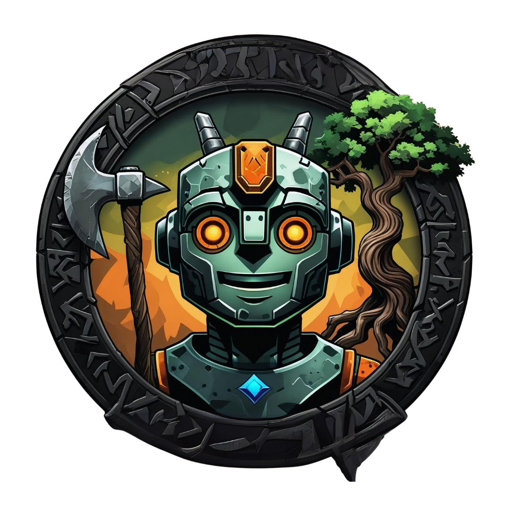

<!-- PROJECT LOGO -->
 

  

  <h3 align="center">Automação Inteligente com Java para Old School RuneScape.</h3>

  

    An awesome README template to jumpstart your projects!
     
  

  
Conteúdo

  <ol>
    <li>
      <a href="#sobre-o-projeto">Sobre o Projeto</a>
    </li>
    <li>
      <a href="#atualizações-e-melhorias">Atualizações e melhorias</a>
    </li>
    <li><a href="#roadmap">Roadmap</a></li>
    <li><a href="#contatos">Contatos</a></li>
    <li><a href="#conteúdo-útil">Conteúdo útil</a></li>
  </ol>

<!-- ABOUT THE PROJECT -->
## Sobre o Projeto

[![Product Name Screen Shot][product-screenshot]](https://example.com)

There are many great README templates available on GitHub; however, I didn't find one that really suited my needs so I created this enhanced one. I want to create a README template so amazing that it'll be the last one you ever need -- I think this is it.

Here's why:
* Your time should be focused on creating something amazing. A project that solves a problem and helps others
* You shouldn't be doing the same tasks over and over like creating a README from scratch
* You should implement DRY principles to the rest of your life :smile:

Algo que tem me ajudado bastante nesse projeto é escrever textos explicando, com minhas próprias palavras, o que estou fazendo em cada etapa. Isso me permite entender melhor o processo e facilita muito quando preciso retomar o projeto depois de um tempo.

This section should list any major frameworks/libraries used to bootstrap your project. Leave any add-ons/plugins for the acknowledgements section. Here are a few examples.

* [![JQuery][JQuery.com]][JQuery-url]

## Atualizações e Melhorias

This is an example of how you may give instructions on setting up your project locally.
To get a local copy up and running follow these simple example steps.

- **v1.4** Adicionei mais um método de treinamento, agora você pode treinar até o nível 60 (na v1.35 era até o nível 30). 
- **v1.31** Otimizei as mensagens de log para evitar repetição no terminal.
- **v1.3** Criei um sistema de antiban que simula um jogador humano (movimentos de mouse e pausas aleatórias).
- **v1.2** Agora o usuário pode escolher o tipo de árvore e o modo de treino com uma GUI que aparece ao iniciar o Script.
- **v1.1** Novo modo: Power Training (Depositar as lenhas ao invés de guardá-las no banco, +XP e -Lucro comparado ao método de banco).

<!-- ROADMAP -->
## Roadmap

- [x] Add Changelog
- [x] Add back to top links
- [ ] Add Additional Templates w/ Examples
- [ ] Add "components" document to easily copy & paste sections of the readme
- [ ] Multi-language Support
    - [ ] Chinese
    - [ ] Spanish

See the [open issues](https://github.com/othneildrew/Best-README-Template/issues) for a full list of proposed features (and known issues).

## Contatos

**Lucas Goes**  
[LinkedIn](https://www.linkedin.com/in/lukgoes) • [GitHub](https://github.com/lukegoes)

## Conteúdo útil

Use this space to list resources you find helpful and would like to give credit to. I've included a few of my favorites to kick things off!

* [Choose an Open Source License](https://choosealicense.com)
* [GitHub Emoji Cheat Sheet](https://www.webpagefx.com/tools/emoji-cheat-sheet)
* [Malven's Flexbox Cheatsheet](https://flexbox.malven.co/)
* [Malven's Grid Cheatsheet](https://grid.malven.co/)
* [Img Shields](https://shields.io)
* [GitHub Pages](https://pages.github.com)
* [Font Awesome](https://fontawesome.com)
* [React Icons](https://react-icons.github.io/react-icons/search)

<!-- MARKDOWN LINKS & IMAGES -->
<!-- https://www.markdownguide.org/basic-syntax/#reference-style-links -->
[contributors-shield]: https://img.shields.io/github/contributors/othneildrew/Best-README-Template.svg?style=for-the-badge
[contributors-url]: https://github.com/othneildrew/Best-README-Template/graphs/contributors
[forks-shield]: https://img.shields.io/github/forks/othneildrew/Best-README-Template.svg?style=for-the-badge
[forks-url]: https://github.com/othneildrew/Best-README-Template/network/members
[stars-shield]: https://img.shields.io/github/stars/othneildrew/Best-README-Template.svg?style=for-the-badge
[stars-url]: https://github.com/othneildrew/Best-README-Template/stargazers
[issues-shield]: https://img.shields.io/github/issues/othneildrew/Best-README-Template.svg?style=for-the-badge
[issues-url]: https://github.com/othneildrew/Best-README-Template/issues
[license-shield]: https://img.shields.io/github/license/othneildrew/Best-README-Template.svg?style=for-the-badge
[license-url]: https://github.com/othneildrew/Best-README-Template/blob/master/LICENSE.txt
[linkedin-shield]: https://img.shields.io/badge/-LinkedIn-black.svg?style=for-the-badge&logo=linkedin&colorB=555
[linkedin-url]: https://linkedin.com/in/othneildrew
[product-screenshot]: images/screenshot.png
[JQuery.com]: https://img.shields.io/badge/jQuery-0769AD?style=for-the-badge&logo=jquery&logoColor=white
[JQuery-url]: https://jquery.com 
